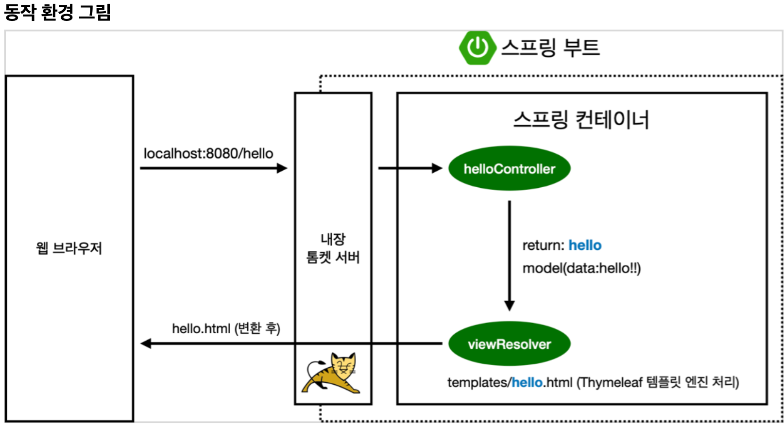
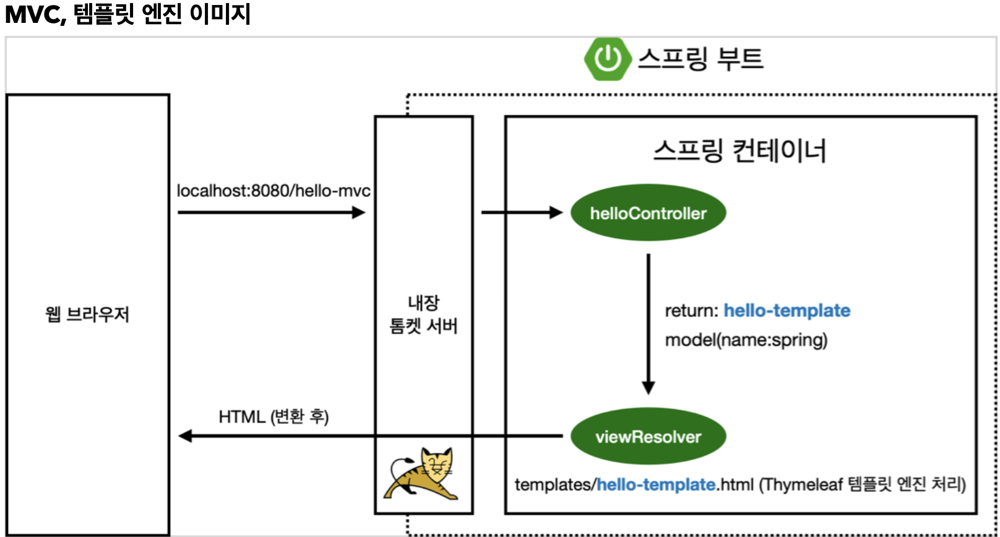
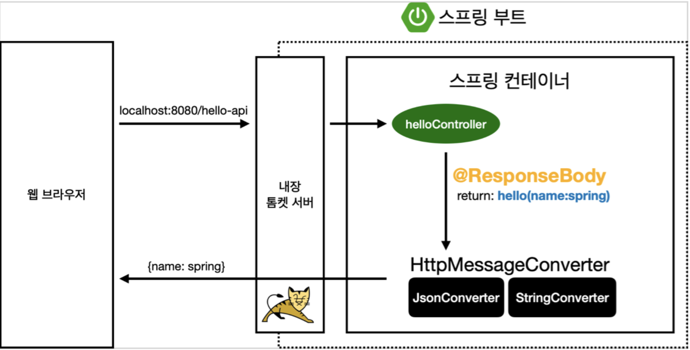
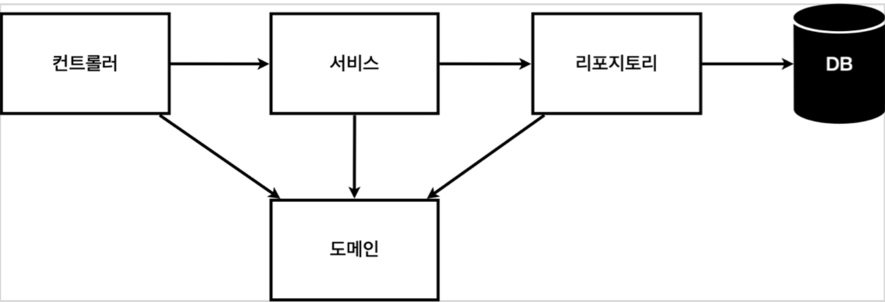
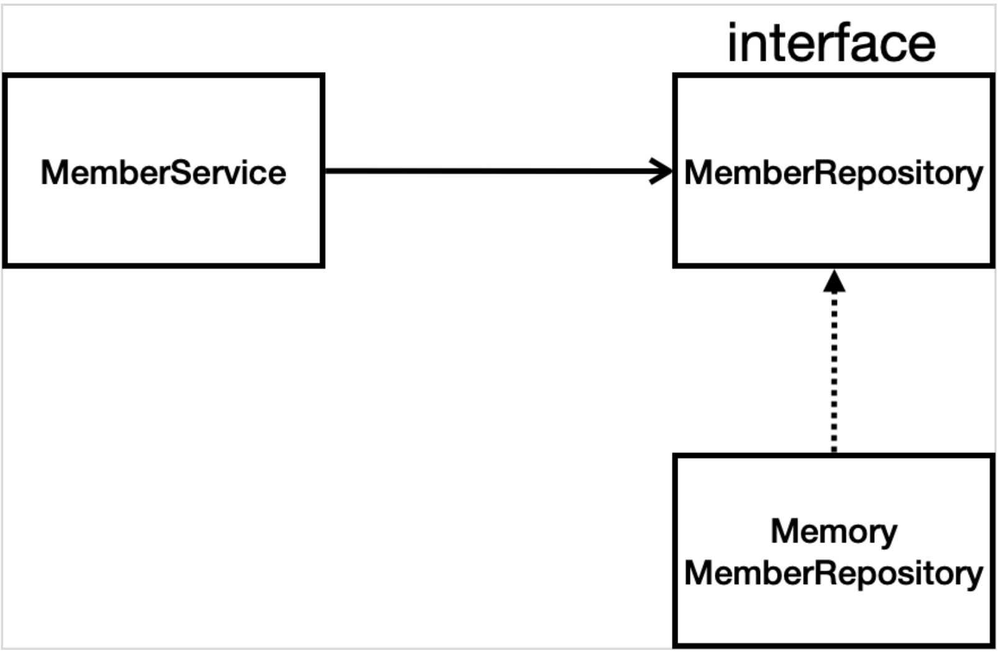

# 2024.01.25
## Spring
- Spring Boot 3.0 Gradle - Groovy 버전
- java 17 LTS 버전

## 라이브러리
### 스프링 부트 라이브러리
- spring-boot-starter-web
    - spring-boot-starter-tomcat: 톰캣(웹서버)
    - spring-webmvc: 스프링 웹 MVC
- spring-boot-starter-tymeleaf: 타임리프 템플릿 엔진(View)
- spring-boot-starter(공통): 스프링 부트 + 스프링 코어 + 로깅
    - spring-boot
        - spring-core
    - spring-boot-starter-logging
        - logback, slf4j

### 테스트 라이브러리
- spring-boot-starter-test
    - junit: 테스트 프레임워크
    - mockito: 목 라이브러리
    - assertj: 테스트 코드를 좀 더 편하게 작성하게 도와줌
    - spring-test: 스프링 통합 테스트 지원



## MVC와 템플릿 엔진
MVC: Model, View, Controller
### Controller
``` java
@Controller
public class HelloController {
    @GetMapping("hello-mvc")
    public String helloMvc(@RequestParam("name") String name, Model model) {
        model.addAttribute("name", name);
            return "hello-template";
    }
}
```
- 웹 MVC의 컨트롤러 역할

### View
``` html
<html xmlns:th="http://www.thymeleaf.org">
    <body>
        <p th:text="'hello ' + ${name}">hello! empty</p>
    </body>
</html>
```


## API
@ResponseBody 문자 변환
``` java
@Controller
public class HelloController {
    @GetMapping("hello-string")
    @ResponseBody
    public String helloString(@RequestParam("name") String name) {
        return "hello " + name;
    }
}
```
- @ResponseBody를 사용하면 viewResolver를 사용하지 않음
- 대신에 HTTP의 Body에 문자 내용을 직접 반환

@ResponseBody 객체 변환
``` java
@Controller
public class HelloController {
    @GetMapping("hello-api")
    @ResponseBody
    public Hello helloApi(@RequestParam("name") String name) {
        Hello hello = new Hello();
        hello.setName(name);
            return hello;
    }

    static class Hello {
        private String name;
        public String getName() {
            return name;
        }

        public void setName(String name) {
            this.name = name;
        } 
    }
}
```
- 객체를 반환하면 객체가 json으로 변환됨
- Hello객체의 반환


- @ResponseBody를 사용
    - HTTP의 Body에 문자 내용을 직접 반환
    - viewResolver 대신에 HttpMessageConverter가 동작
    - 기본 문자처리: StringHttpMessageConverter
    - 기본 객체처리: MappingJackson2HttpMessageConverter
    - byte 처리 등등 기타 여러 HttpMessageConverter가 기본으로 등록

일반적인 웹 애플리케이션 계층 구조

- 컨트롤러: 웹 MVC의 컨트롤러 역할. 즉, 외부에서 요청한 서비스에 대한 것을 제어. 외부에만 보임
- 서비스: 핵심 비즈니스 로직 구현. 즉, 사용자가 원하는 기능
- 레포지터리: 데이터베이스에 접근, 도메인 객체를 DB에 저장하고 관리. 즉, DB에 저장된 것을 이곳을 통해 정보를 불러오고 사용하게 됨.
- 도메인: 비즈니스 도메인 객체, 예) 회원, 주문, 쿠폰 등등 DB에 저장하고 관리됨. 즉, 한마디로 객체

클래스 의존관계

- 데이터 저장소가 선정되지 않아 -> 인터페이스로 구현 클래스를 변경할 수 있도록 설계
- 데이터 저장소는 RDB, MySQL 등등 다양한 저장소를 고민중인 상황으로 가정
- 개발을 진행하기 위해서 초기 개발 단계에서는 구현체로 가벼운 메모리 기반의 데이터 저장소 사용